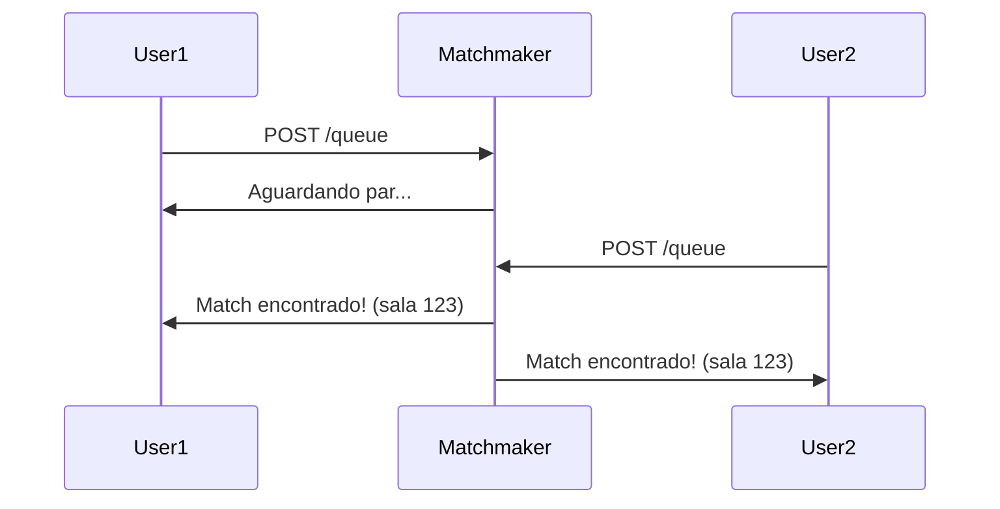

# Matchmaker Service (Go)

This service is responsible for matching users into chat sessions. Built with Go for high performance and concurrency.

## Purpose
- Queue online users
- Randomly pair users for chat
- Communicate with other services via messaging or API

## Running
This service can be run independently. See the main.go or service documentation for details. 

## Exemplo de Fluxo em Diagrama

